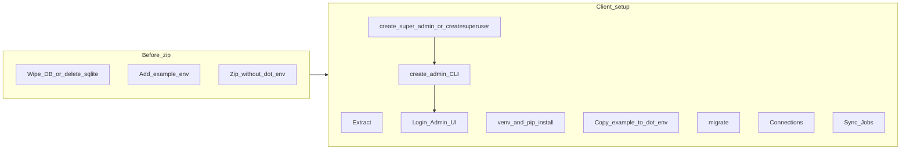

# Detailed client handoff plan (DB wipe, zip, env, first-run users)

## Context from this codebase

- **Project root for commands**: [`dbsync_tool/`](dbsync_tool/) (where `manage.py` and [`requirements.txt`](dbsync_tool/requirements.txt) live).
- **Default DB**: SQLite at [`dbsync_tool/db.sqlite3`](dbsync_tool/db.sqlite3) unless `DB_ENGINE` selects Postgres ([`settings.py`](dbsync_tool/dbsync_tool/settings.py) lines 94–116).
- **Roles**: [`accounts/signals.py`](dbsync_tool/accounts/signals.py) auto-creates `UserProfile` — superuser → Super Admin; staff → Admin with tenant=self.
- **Connections restriction**: Super Admin cannot create DB connections in UI ([`connections/views.py`](dbsync_tool/connections/views.py)); tenant **Admin** must create connections and sync jobs.
- **Management commands already present**:
  - [`create_super_admin`](dbsync_tool/accounts/management/commands/create_super_admin.py): interactive or `--username` / `--password` / `SUPER_ADMIN_PASSWORD`.
  - [`create_admin`](dbsync_tool/accounts/management/commands/create_admin.py): creates **tenant Admin** (`is_staff=True`, `is_superuser=False`) — `--username` required; `ADMIN_PASSWORD` optional.
  - [`delete_all_data`](dbsync_tool/accounts/management/commands/delete_all_data.py): nukes app data with `--confirm` (optional `--keep-super-admin`).
- **`SECRET_KEY` / `DEBUG`**: Currently **hardcoded** in [`settings.py`](dbsync_tool/dbsync_tool/settings.py) (lines 24–28). Environment variables in the table below are what **already** read from `os.environ` today; wiring `SECRET_KEY`/`DEBUG` via `.env` would be a **separate code change** if you want clients to control them without editing files.

## make sure the dblite is empty before the zip is send without 



---

## Phase 1 — You (developer): empty data before shipping

**Goal**: No customer secrets and no stale SQLite file (or a consciously chosen empty state).

### Option A — Fresh SQLite handoff (simplest)

1. Stop the dev server if running.
2. Delete the SQLite file so the client runs migrations on a clean DB:
   - Remove [`dbsync_tool/db.sqlite3`](dbsync_tool/db.sqlite3) if it exists.

### Option B — Keep repo folder but wipe rows inside DB

1. From `dbsync_tool/` with Django configured:

```bash
python manage.py delete_all_data --confirm
```

- Read the command help for `--keep-super-admin` if you need to retain one root user (usually **omit** this for a cold client handoff).

### Optional cleanup

- Remove any local `.env` before zipping (Phase 3).
- Exclude `venv/`, `__pycache__/`, `.pytest_cache/` from the archive (Phase 3).

---

## Phase 2 — `example.env` contents (template with empty / placeholder values)

**Deliverable**: One file committed or placed next to `manage.py`, e.g. [`dbsync_tool/example.env`](dbsync_tool/example.env) (name can be `example.env` or `.env.example`; avoid committing real `.env`).

**Convention**: Use empty values `=` or placeholders like `<fill>` where the client must substitute. Below maps **only** variables referenced in [`settings.py`](dbsync_tool/dbsync_tool/settings.py) and [README DevOps section](dbsync_tool/README.md).

| Variable | Purpose | Typical client value |
|----------|-----------|----------------------|
| `DB_ENGINE` | `postgres` / `postgresql` / `pg` vs SQLite | Leave **empty** or unset for SQLite; set `postgres` for Postgres |
| `POSTGRES_DB` | DB name | e.g. `dbsync` |
| `POSTGRES_USER` | DB user | e.g. `dbsync_app` |
| `POSTGRES_PASSWORD` | DB password | strong secret |
| `POSTGRES_HOST` | host | e.g. `localhost` or RDS hostname |
| `POSTGRES_PORT` | port | `5432` |
| `ENCRYPTION_KEY` | Fernet key for stored connection passwords | Generate once: `python -c "from cryptography.fernet import Fernet; print(Fernet.generate_key().decode())"` — **must stay stable** after first encrypted rows exist |
| `SYNC_EXECUTION_STALE_TIMEOUT_MINUTES` | Stale execution timeout | e.g. `30` |
| `FILE_SYNC_ROOT` | Absolute path root for CSV/file sync | server path |
| `FILE_SYNC_STRICT` | `True`/`False` | `True` for strict checks |
| `EMAIL_*`, `ADMIN_EMAILS`, `SITE_URL` | Mail and links | production SMTP / public URL |
| `SECURE_SSL_REDIRECT` | When `DEBUG` is False | `True` behind HTTPS |
| **DevOps incremental (optional)** | Per [README](dbsync_tool/README.md) | `REDIS_HOST`, `REDIS_PORT`, `REDIS_DB`, `REDIS_KEY_PREFIX` |

**What to tell the client to put in their real `.env`**

- **Minimal local SQLite trial**: Often only `ENCRYPTION_KEY` (recommended so they are not on the dev fallback key that prints a warning).
- **Postgres**: Set `DB_ENGINE=postgres` plus all `POSTGRES_*`.
- **Production**: Strong `ENCRYPTION_KEY`, correct DB vars, email/site URLs; ensure `DEBUG=False` is enforced **in code or deployment** (currently not driven by `.env` unless you extend settings).

---

## Phase 3 — Zip **without** `.env`

**Never** ship `.env` with real secrets.

### Windows PowerShell (from parent of `dbsync_tool`)

Using built-in `tar` (available on Windows 10+) from the folder **containing** `dbsync_tool`:

```powershell
tar -a -c -f dbsync_tool-handoff.zip --exclude=".env" --exclude="dbsync_tool/.env" --exclude="dbsync_tool/db.sqlite3" --exclude="dbsync_tool/venv" --exclude="**/__pycache__" --exclude="**/.pytest_cache" dbsync_tool
```

Adjust `--exclude` patterns if your tree differs (e.g. exclude root `.venv`).

### Alternative: zip manually

1. Copy `dbsync_tool` to a temp folder.
2. Delete `.env`, `db.sqlite3`, `venv` inside the copy.
3. Zip the temp folder.

---

## Phase 4 — Client: extract and “new project” Python environment

1. Extract `dbsync_tool-handoff.zip` to a path without spaces if possible (optional).
2. Open terminal in [`dbsync_tool/`](dbsync_tool/).

**Windows**

```powershell
python -m venv .venv
.\.venv\Scripts\Activate.ps1
python -m pip install --upgrade pip
pip install -r requirements.txt
```

**Linux/macOS**

```bash
python3 -m venv .venv
source .venv/bin/activate
pip install --upgrade pip
pip install -r requirements.txt
```

3. Copy template to real env file:

```bash
copy example.env .env
```

(or `cp example.env .env`) then edit `.env` with editor.

---

## Phase 5 — Client: database migrate

From `dbsync_tool/` with venv activated:

```bash
python manage.py migrate
```

If using Postgres, ensure the database exists and credentials match `.env` before this step.

---

## Phase 6 — Client: create Super Admin

**Preferred (matches project naming)**:

```bash
python manage.py create_super_admin
```

Non-interactive example:

```bash
python manage.py create_super_admin --username root --password "<STRONG_PASSWORD>" --no-input
```

Or standard Django:

```bash
python manage.py createsuperuser
```

Both yield a user with `UserProfile` **Super Admin** when `is_superuser=True` (signal).

---

## Phase 7 — Client: create tenant Admin (required for connections UI)

Super Admin **cannot** create connections ([`connections/views.py`](dbsync_tool/connections/views.py)); create an Admin:

```bash
python manage.py create_admin --username admin1 --email admin1@example.com
```

Interactive password prompt, or:

```bash
python manage.py create_admin --username admin1 --password "<STRONG_PASSWORD>" --no-input
```

This sets `is_staff=True`, `is_superuser=False`, and `UserProfile` role **Admin** with `tenant` = that user ([`create_admin.py`](dbsync_tool/accounts/management/commands/create_admin.py)).

**Alternative**: Super Admin logs into the web app and creates an Admin via **User Management** (if that UI is enabled for your deployment).

---

## Phase 8 — Client: application workflow (Connections → Jobs)

1. Log out; log in as **Admin** (`admin1`).
2. **Connections**: Add source/target database connections (MongoDB, Postgres, ClickHouse, etc.), run **Test connection**, save.
3. **Sync Jobs**: Create a job (wizard: connections, tables, full/incremental, schedule per product UI).
4. Run job from UI or scheduled runner as documented in [`README.md`](dbsync_tool/README.md).

---

## Phase 9 — Verification checklist

- [ ] `migrate` succeeds.
- [ ] Super Admin can log in.
- [ ] Admin can log in and open Connections without “Super Admin cannot create connections”.
- [ ] Connections save and test successfully.
- [ ] Sync job creates and runs (check logs under configured log paths if issues occur).
- [ ] `ENCRYPTION_KEY` set for non-dev use; warning in console should disappear.

---

## Optional follow-up (not required for the runbook)

- Add **`example.env`** to the repo and document these steps in a single short `CLIENT_SETUP.md` (you asked for a plan only here).
- Optionally refactor [`settings.py`](dbsync_tool/dbsync_tool/settings.py) to read `SECRET_KEY` and `DEBUG` from environment so `.env` fully controls deployment without editing source.
